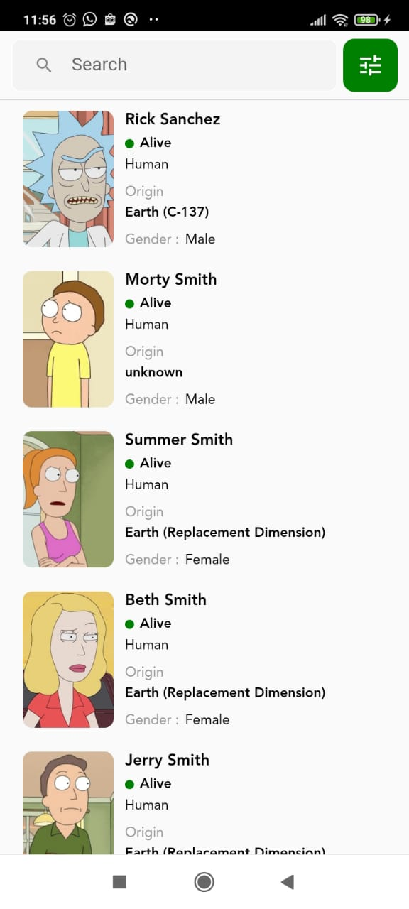
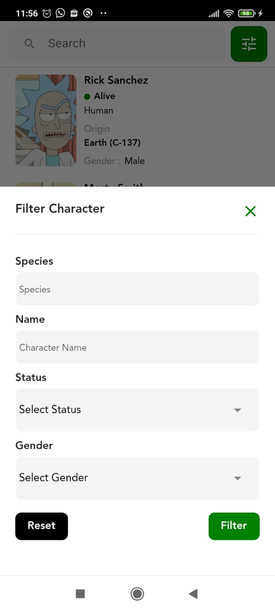

# Flutter Bloc Latihan parsing API (Filtering dan Load More)

Aplikasi Sederhana menggunakan State Management Bloc dan Dio untuk call
API dari https://rickandmortyapi.com/

Aplikasi dibuat menggunakan Flutter versi 2.10.5

Selamat Mempelajari dan semoga bermanfaat :D

 Screen Shoot Aplikasi
 
 

